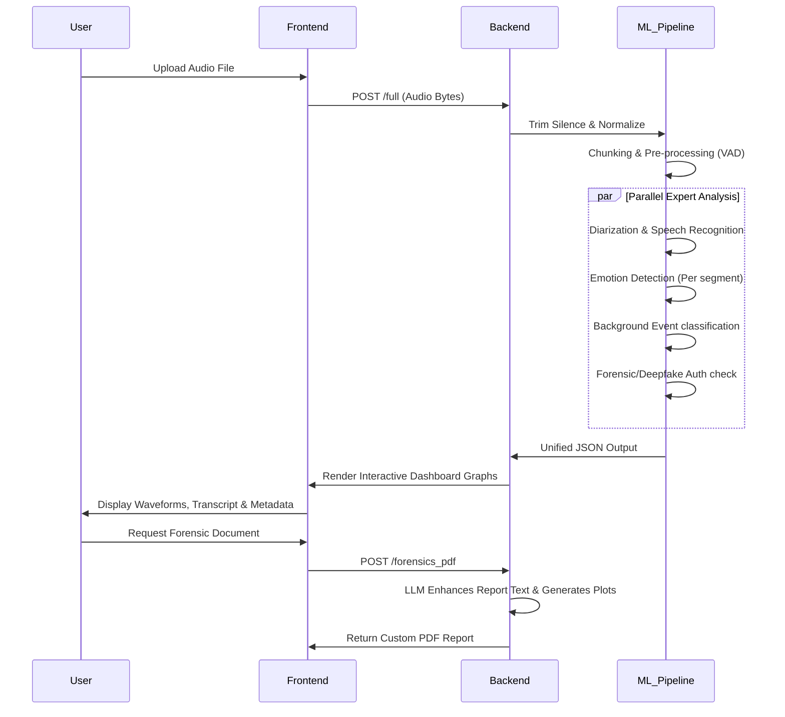

# DECIBEL - Audio Intelligence Platform

DECIBEL is a comprehensive, end-to-end audio intelligence platform that converts raw audio into structured, explainable intelligence. It goes beyond simple transcription by extracting speakers, emotions, background events, and forensic-level threats from any audio source.

## 🚀 Features

- **End-to-End Audio Intelligence**: Processes audio through specialized expert modules including VAD, Diarization, ASR, Linguistic Analysis, Emotion Detection, and Deepfake Detection.
- **Forensic-Grade Breakdown**: Achieves 97.6% accuracy on deepfake detection, voice cloning, and audio tampering. Provides downloadable Forensic PDF Reports.
- **Multilingual Intelligence**: Native support for 15+ Indic and Asian languages, code-mixing, and translations.
- **Interactive Dashboard**: Real-time waveform, background/foreground separation, and contextual QnA via an AI Analyst.
- **Mixture-of-Experts (MoE) Architecture**: Scalable architecture prioritizing specific expert models based on the audio content and user intent.
- **Edge Compatible**: Designed for low latency/on-premise deployment.

---

## 🏗️ System Architecture

```mermaid
graph TD
    UI[Frontend: Next.js Dashboard] -->|Upload / Questions| API[Backend: FastAPI Gateway]
    
    subgraph Backend Experts
        API --> VAD[VAD Expert]
        VAD -->/ DIAR[Diarization Expert]
        DIAR --> ASR[ASR & Translation Expert]
        ASR --> LING[Linguistic Expert]
        
        API --> SCEN[Scene & Background Event Expert]
        API --> EMO[Emotion Expert]
        API --> DFK[Deepfake & Forensics Expert]
        
        LING --> UNIF[Unification Expert]
        SCEN --> UNIF
        EMO --> UNIF
        DFK --> UNIF
    end
    
    UNIF --> QNA[QnA / LLM Expert]
    UNIF --> PDF[PDF Report Generator]
    
    QNA --> API
    PDF --> API
    API --> UI
```

---

## 🔄 Audio Processing Pipeline



---

## 📂 Codebase Structure

The codebase is modularized into three key components:

### 1. `frontend/` (Next.js App Router)
Provides a rich, interactive Web App built with React, TailwindCSS, Framer Motion, and Next.js.
- **`/app`**: Contains pages for analysis, dashboard, reporting, processing, and multi-file interactive workspace.
- **`/components`**: Reusable UI components from Radix UI and Shadcn.
- **Hooks & Contexts**: Application state management for audio processing sync and visualizations.

### 2. `backend/` (FastAPI Server)
Handles audio routing to ML models, inference coordination, caching, and document generation.
- **`app/main.py`**: Exposes REST endpoints (`/upload_bytes`, `/full`, `/forensics_pdf`, `/asr_diarization`, etc).
- **`app/experts_*.py`**: Specialized machine learning modules for Scene, Emotion, Deepfake, VAD, ASR, and QnA inference.
- **`app/forensics.py`**: Logic for aggregating metrics and compiling them into a final PDF report.

### 3. `ALM_CODE_V2/` (Audio Language Models & Preprocessing)
Core data science and model engineering pipelines.
- **`audioprocessing.py`**: A robust `AudioPreprocessor` class managing WebRTC VAD chunking, mel-spectrogram extraction, and audio segmentation designed to feed deep learning models limitlessly.
- **`modeldesign.ipynb`**: Research iteration workflows and neural network drafting for the Mixture of Experts.

---

## 🛠️ Setup & Installation

### Prerequisites
- Python >= 3.12
- Node.js >= 18 and `pnpm`
- NVIDIA GPU (Recommended for Backend)

### Backend Setup
```bash
cd backend
python -m venv venv
source venv/bin/activate  # On Windows: venv\Scripts\activate
pip install -r requirements.txt
# To run the API server
uvicorn app.main:app --host 0.0.0.0 --port 8000 --reload
```

### Frontend Setup
```bash
cd frontend
pnpm install
# To run the frontend dev server
pnpm dev
```
Navigate to `http://localhost:3000`.

---

## 🛡️ License & Acknowledgements
Developed as part of SIH (Smart India Hackathon) by Team Gradient Ascent.
